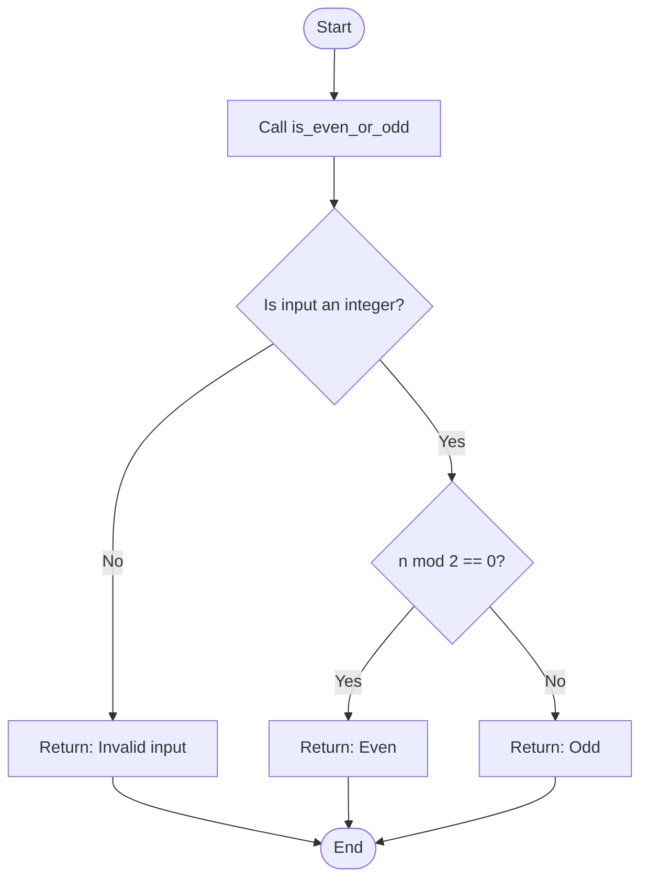

```mermaid
flowchart TD
  Start([Start]) --> Input[Call is_even_or_odd]
  Input --> IsInt{Is input an integer?}
  IsInt -- No --> Invalid[Return: Invalid input]
  Invalid --> End([End])
  IsInt -- Yes --> IsEven{n mod 2 == 0?}
  IsEven -- Yes --> Even[Return: Even]
  IsEven -- No --> Odd[Return: Odd]
  Even --> End
  Odd --> End
```
